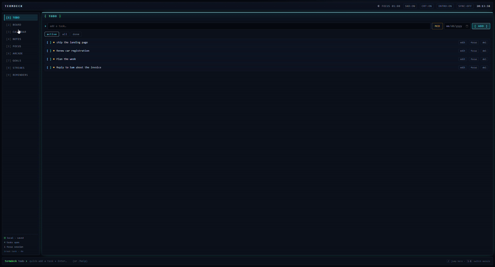
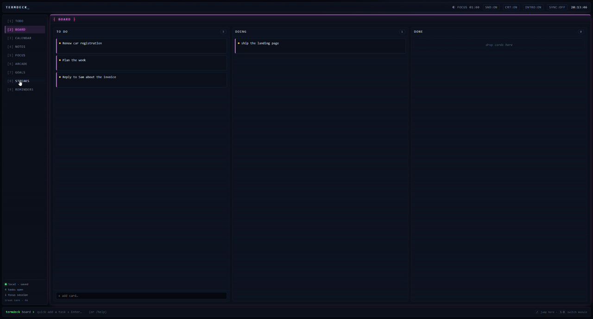
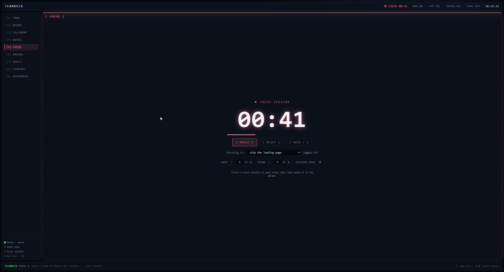
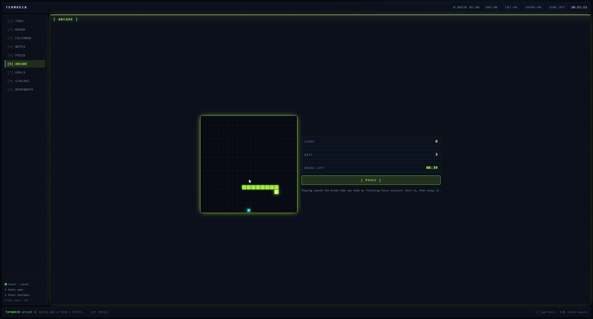

# TermDeck

**A to-do list, kanban board, calendar, notes and focus timer in one retro terminal window. Finish a focus session and you earn time in the arcade.**


[](https://github.com/tatetimeusa/TermDeck/releases/latest/download/TermDeck-windows-x64.zip)
[](https://github.com/tatetimeusa/TermDeck/releases/latest/download/TermDeck-mac-universal.zip)

Works offline, and your data stays on your computer. [All releases](https://github.com/tatetimeusa/TermDeck/releases)

## How it works

There is one list of tasks, and every module works on it. Add a task in TODO, drag it across the BOARD, see its due date on the CALENDAR, and time it in FOCUS. Change it in one place and it changes everywhere.

The arcade is the reward. Every focus session you finish banks break time, and break time is the only thing that unlocks Snake. Playing spends it. When it runs out, you go back to work.

## Screenshots

| | |
|---|---|
|  |  |
| **TODO**: tasks with priority and due dates | **BOARD**: drag cards between To Do, Doing and Done |
|  |  |
| **FOCUS**: a Pomodoro timer that logs time to the task | **ARCADE**: Snake, paid for with the break time you earned |

## All nine modules

Press `1` to `9` to jump between them, or `/` to open the command bar and type things like `/todo buy milk` or `/go focus`.

1. **TODO**: add tasks with priority and due dates, edit them, check them off, filter the list.
2. **BOARD**: kanban columns. Dropping a card on Done completes the task.
3. **CALENDAR**: a month view that shows dated tasks, goal deadlines and reminders automatically.
4. **NOTES**: as many notes as you want, saved as you type, and attachable to a task.
5. **FOCUS**: a Pomodoro timer with work and break lengths you set yourself (1 to 999 minutes).
6. **ARCADE**: Snake, locked until you have banked break time.
7. **GOALS**: goals over any date range, with a progress bar that fills as you check in.
8. **STREAKS**: a daily check-off per goal with a 🔥 counter, plus a "You vs 100,000" tally of imaginary rivals you have outlasted.
9. **REMINDERS**: one-off or repeating reminders with popups, snooze and real Windows notifications. Anything missed while the app was closed is caught up when it opens.

The rest is feel: a boot intro down a wireframe tunnel, soft click sounds, optional CRT scanlines, and a different glow colour for every module. Each one has its own on/off switch in the top bar.

## Install

**Windows:** download `TermDeck-windows-x64.zip`, unzip it anywhere and run `TermDeck.exe`.

The first time, Windows shows a blue "Windows protected your PC" notice because the app is not code-signed yet. Click **More info**, then **Run anyway**.

**macOS:** download `TermDeck-mac-universal.zip`, unzip it and drag `TermDeck.app` into Applications. The app is not signed by Apple yet, so run this once in Terminal before the first launch:

```
xattr -cr /Applications/TermDeck.app
```

## Sync (optional)

You never need an account. If you want your deck on more than one computer, click the **SYNC** badge (or type `/login`) and sign in with an email and password. Your tasks, notes, goals and reminders then follow you between machines.

**Forgot your password?** Click "forgot password?" on the sign-in form, or type `/forgot`. You will get an email with a code. Type the code into the app and pick a new password. Ignore the link in that email: the desktop app cannot open it, so the code is what works.

Finishing a reset also signs you in, and the first sign-in on a computer loads the synced copy of your deck. To change a password you already know, use **CHANGE PASSWORD** in the account panel, or type `/passwd`.

### Running your own sync server

Sync runs on Supabase. It needs `VITE_SUPABASE_URL` and `VITE_SUPABASE_ANON_KEY` in `.env`, and a `decks` table with one row per user, a `jsonb` `data` column and row-level security on `user_id`. Two Auth settings are also required, and password reset will not work without the first one:

1. **Auth → Emails → Templates → Reset Password:** include `{{ .Token }}`, which is the code the app asks for. Remove `{{ .ConfirmationURL }}`, because that link goes somewhere the packaged app cannot receive.
2. **Project Settings → Authentication → SMTP:** point it at a real email sender such as Resend, Postmark or SES. Supabase's built-in sender only reaches your own team's addresses and sends a handful of emails an hour, so codes will not reach anyone else. Raise **Auth → Rate Limits → emails** to match.

Leave "Secure password change" off, or changing a password will also ask for the old one.

## Run from source

```bash
npm install
npm run dev        # browser dev server at http://localhost:5173
npm run app        # build and open the desktop window
npm run package    # build the standalone Windows app into release/
```

Built with React, Vite and Zustand, and packaged with Electron.
